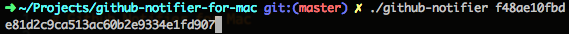

# Github Notifier for Mac

A simple tool, which can notify you any new notification in Github.

Depends on Notification Center, Mac OS X >= 10.8

## Install

1. Download source code to one of your directories.
2. This project depends on [terminal-notifier](https://github.com/alloy/terminal-notifier),
execute this if you use [HomeBrew](http://brew.sh/)

  ```sh
  $ brew install terminal-notifier
  ```

3. Open the project directory in your terminal.
4. Execute

  ```sh
  $ ./github-notifier
  ```

  Will open personal access token setting panel.
5. You can generate new token, give it a name and only notifications permission:
  
6. Then you'll be given a token, copy it
  
7. Execute

  ```sh
  $ ./github-notifier <token>
  ```

  
8. Done.

# Uninstall

1. Execute

  ```sh
  $ launchctl unload ~/Library/LaunchAgents/git.bachue.githubnotifier.plist
  ```

2. Delete the project directory.
3. Done.
